# AI-Assisted QA Workflow — CaseWork App

> Claude handled every step of testing a new case end-to-end — from automation to issue tracking.

## What was done

**1 → Jira** — Claude connected to Jira and created a full test plan along with all individual test cases for the new CaseWork feature.

**2 → WebdriverIO** — Claude automated every test case using the WebdriverIO framework. No manual scripting required.

**3 → GitHub** — Claude copied all test cases to GitHub as issues for tracking and visibility.

## Stack

`Jira` · `WebdriverIO` · `GitHub`

Powered by **Claude** (Anthropic)
